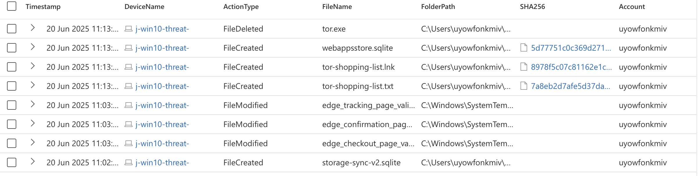
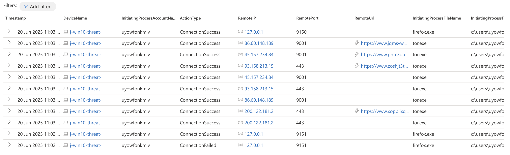

# Official [Cyber Range](http://joshmadakor.tech/cyber-range) Project


# Threat Hunt Report: Unauthorized TOR Usage
- [Scenario Creation](threat-hunting-scenario-tor-event-creation.md)

## Platforms and Languages Leveraged
- Windows 10 Virtual Machines (Microsoft Azure)
- EDR Platform: Microsoft Defender for Endpoint
- Kusto Query Language (KQL)
- Tor Browser

##  Scenario

Management suspects that some employees may be using TOR browsers to bypass network security controls because recent network logs show unusual encrypted traffic patterns and connections to known TOR entry nodes. Additionally, there have been anonymous reports of employees discussing ways to access restricted sites during work hours. The goal is to detect any TOR usage and analyze related security incidents to mitigate potential risks. If any use of TOR is found, notify management.

### High-Level TOR-Related IoC Discovery Plan

- **Check `DeviceFileEvents`** for any `tor(.exe)` or `firefox(.exe)` file events.
- **Check `DeviceProcessEvents`** for any signs of installation or usage.
- **Check `DeviceNetworkEvents`** for any signs of outgoing connections over known TOR ports.

---

## Steps Taken

### 1. Identifying TOR-Related Files in DeviceFileEvents

I queried the `DeviceFileEvents` table for any file activity containing the string `"tor"` on device `j-win10-threat-` by user `uyowfonkmiv`. The search revealed that the user downloaded a Tor Browser installer, which was followed by the creation of several Tor-related files on the desktop and a text file named `tor-shopping-list.txt` in the user's Documents folder at `2025-06-20T02:13:03.034063Z`. These events began at `2025-06-20T01:57:11.869503Z`.

**Query used:**
```kusto
// Check DeviceFileEvents for any tor(.exe) or firefox(.exe) file events
let MyDevice = "j-win10-threat-";
DeviceFileEvents
| where DeviceName == MyDevice
| where FileName contains "tor"
| where InitiatingProcessAccountName == "uyowfonkmiv"
| where Timestamp >= datetime(2025-06-20T01:57:11.869503Z)
| order by Timestamp desc
| project Timestamp, DeviceName, ActionType, FileName, FolderPath, SHA256, Account = InitiatingProcessAccountName
````



---

### 2. Detecting Silent Installation of Tor Browser

I examined the `DeviceProcessEvents` table for any `ProcessCommandLine` that included `tor-browser-windows-x86_64-portable-14.5.3.exe`. At `2025-06-20T02:01:15.2403386Z`, user `uyowfonkmiv` executed the installer from the Downloads folder using the `/S` flag (silent install), triggering a process creation event with an associated SHA256 hash.

**Query used:**

```kusto
// Check DeviceProcessEvents for any signs of installation or usage
let MyDevice = "j-win10-threat-";
DeviceProcessEvents
| where DeviceName == MyDevice
| where ProcessCommandLine contains "tor-browser-windows-x86_64-portable-14.5.3.exe"
| project Timestamp, DeviceName, AccountName, ActionType, FileName, FolderPath, SHA256, ProcessCommandLine
```


---

### 3. Verifying Execution of Tor Browser

To confirm whether the user actually launched the Tor Browser, I searched the `DeviceProcessEvents` table for execution of files such as `tor.exe` or `firefox.exe`. At `2025-06-20T02:02:41.2739331Z`, there was a confirmed launch of `firefox.exe`, followed by additional instances of both `firefox.exe` and `tor.exe`, indicating full Tor Browser execution.

**Query used:**

```kusto
// Check DeviceProcessEvents for signs that the TOR browser was executed and used
let MyDevice = "j-win10-threat-";
DeviceProcessEvents
| where DeviceName == MyDevice
| where FileName has_any ("tor.exe", "firefox.exe", "torbrowser-install.exe", "torbrowser-launcher.exe", "tor-browser.exe", "tor-browser-windows.exe", "start-tor-browser.exe")
| order by Timestamp desc
| project Timestamp, DeviceName, AccountName, ActionType, FileName, FolderPath, SHA256, ProcessCommandLine
```


---

### 4. Confirming Network Communication via Tor

I reviewed the `DeviceNetworkEvents` table to detect any outbound connections over ports commonly used by Tor. At `2025-06-20T02:02:53.8197801Z`, user `uyowfonkmiv` established a connection using `tor.exe` to IP address `45.157.234.84` over port `9001`, confirming Tor relay activity. Additional connections were observed on ports `443` and `9150`, indicating encrypted browsing and internal Tor communication.

**Query used:**

```kusto
// Check DeviceNetworkEvents for any signs of outgoing connections over known TOR ports
let MyDevice = "j-win10-threat-";
DeviceNetworkEvents
| where DeviceName == MyDevice
| where InitiatingProcessAccountName != "system"
| where InitiatingProcessFileName in ("tor.exe", "firefox.exe")
| where RemotePort in ("9001", "9030", "9050", "9051", "9150", "9151", "80", "443")
| order by Timestamp desc
| project Timestamp, DeviceName, InitiatingProcessAccountName, ActionType, RemoteIP, RemotePort, RemoteUrl, InitiatingProcessFileName, InitiatingProcessFolderPath
```



---

## Chronological Event Timeline 

## 1. File Renamed - TOR Installer

- **Timestamp:** 2025-06-20T01:57:11.869503Z
- **Event:** The user "uyowfonkmiv" renamed a file named `tor-browser-windows-x86_64-portable-14.5.3.exe` in the Downloads folder.
- **Action:** File rename detected, likely indicating preparation for installation.
- **File Path:** `C:\Users\uyowfonkmiv\Downloads\tor-browser-windows-x86_64-portable-14.5.3.exe`

## 2. Process Execution - TOR Browser Installation

- **Timestamp:** 2025-06-20T02:01:15.2403386Z
- **Event:** The user "uyowfonkmiv" executed the renamed Tor Browser installer in silent mode using the `/S` flag.
- **Action:** Process creation detected.
- **Command:** `tor-browser-windows-x86_64-portable-14.5.3.exe /S`
- **File Path:** `C:\Users\uyowfonkmiv\Downloads\tor-browser-windows-x86_64-portable-14.5.3.exe`

## 3. File Creation - TOR Program Files

- **Timestamps:** 2025-06-20T02:01:29Z to 2025-06-20T02:01:38Z
- **Event:** Multiple files related to the Tor Browser were created on the desktop, including the main binary (`tor.exe`), documentation files, and a desktop shortcut.
- **Action:** File creation detected.
- **Files Created:**
- * tor.exe
- * tor.txt
- * Torbutton.txt
- * Tor-Launcher.txt
- * Tor Browser.lnk
- **Directory:** `C:\Users\uyowfonkmiv\Desktop\Tor Browser`

## 4. Process Execution - TOR Browser Launch

- **Timestamp:** 2025-06-20T02:02:41.2739331Z
- **Event:** The user launched the Tor Browser (`firefox.exe`) from the desktop directory.
- **Action:** Process creation of Tor Browser detected.
- **File Path:** `C:\Users\uyowfonkmiv\Desktop\Tor Browser\Browser\firefox.exe`

## 5. Process Execution - TOR Runtime (tor.exe and firefox.exe)

- **Timestamps:** 2025-06-20T02:02:46Z to 2025-06-20T02:03:23Z
- **Event:** The system spawned multiple instances of `firefox.exe` and one `tor.exe` process, indicating full execution of the Tor Browser’s internal architecture.
- **Action:** Multiple process creation events detected.
- **Notable Process:** `tor.exe` was run with custom configuration flags using torrc files and SOCKS proxy setup.
- **tor.exe Path:** `C:\Users\uyowfonkmiv\Desktop\Tor Browser\Browser\TorBrowser\Tor\tor.exe`

## 6. Network Connection - TOR Network Entry

- **Timestamp:** 2025-06-20T02:03:09.9754231Z
- **Event:** The user’s system, via `tor.exe`, successfully established an external connection to IP address `93.158.213.15` on port `443`, and also connected to `45.157.234.84` on port `9001`, which is commonly used for Tor relays.
- **Action:** Outbound Tor network traffic confirmed.
- **Process:** `tor.exe`
- **File Path:** `C:\Users\uyowfonkmiv\Desktop\Tor Browser\Browser\TorBrowser\Tor\tor.exe`

## 7. Additional Network Connections - Tor Browser Activity

**Timestamps:**
- * 2025-06-20T02:03:06Z – Connected to `200.122.181.2` on port `443`
- * 2025-06-20T02:03:08Z – Connected to `86.60.148.189` on port `9001`
- * 2025-06-20T02:03:10Z – Connections to hidden service domains
- * 2025-06-20T02:03:17Z – Localhost communication over port `9150`
 
- **Event:** Multiple successful connections were initiated by both `tor.exe` and `firefox.exe`, suggesting Tor routing and potential browsing.
- **Action:** Ongoing encrypted traffic and relay usage via Tor.
- **Processes:** `tor.exe` and `firefox.exe`

## 8. File Creation - User Note or Artifact

- **Timestamp:** 2025-06-20T02:13:03.034063Z
- **Event:** A text file named `tor-shopping-list.txt` was created in the user's Documents folder. This may suggest a list of tasks, sites, or actions related to Tor activity.
- **Action:** File creation detected.
- **File Path:** `C:\Users\uyowfonkmiv\Documents\tor-shopping-list.txt`

## 9. File Deletion - Cleanup Activity

- **Timestamp:** 2025-06-20T02:13:23Z
- **Event:** The file `tor.exe` was deleted from the Tor Browser installation directory.
- **Action:** File deletion detected, possibly indicating an attempt to cover tracks or uninstall.
- **File Path:** `C:\Users\uyowfonkmiv\Desktop\Tor Browser\Browser\TorBrowser\Tor\tor.exe`

---

## Summary

The user "employee" on the "threat-hunt-lab" device initiated and completed the installation of the TOR browser. They proceeded to launch the browser, establish connections within the TOR network, and created various files related to TOR on their desktop, including a file named `tor-shopping-list.txt`. This sequence of activities indicates that the user actively installed, configured, and used the TOR browser, likely for anonymous browsing purposes, with possible documentation in the form of the "shopping list" file.

On June 20, 2025, user `uyowfonkmiv` downloaded and silently installed the Tor Browser on host `j-win10-threat-`. Shortly after installation, they launched the browser, triggering multiple firefox.exe and tor.exe processes.

The system established connections to known Tor relay IPs and localhost proxies, confirming active use of the Tor network. About 10 minutes later, the user created a file called `tor-shopping-list.txt`, along with browsing data artifacts, suggesting ongoing or planned activity within the Tor environment.

Later, the user deleted `tor-shopping-list.txt`, indicating an attempt to remove evidence of their actions. These activities point to intentional and privacy-aware Tor usage, potentially for suspicious purposes.

---

## Response Taken

TOR usage was confirmed on the endpoint `j-win10-threat-` by the user `uyowfonkmiv`. The device was isolated, and the user's direct manager was notified.

---
