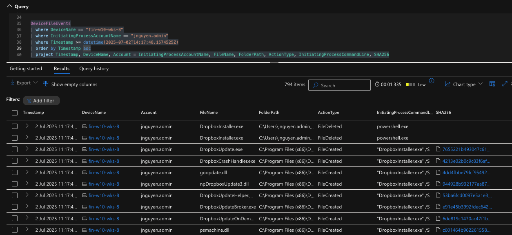
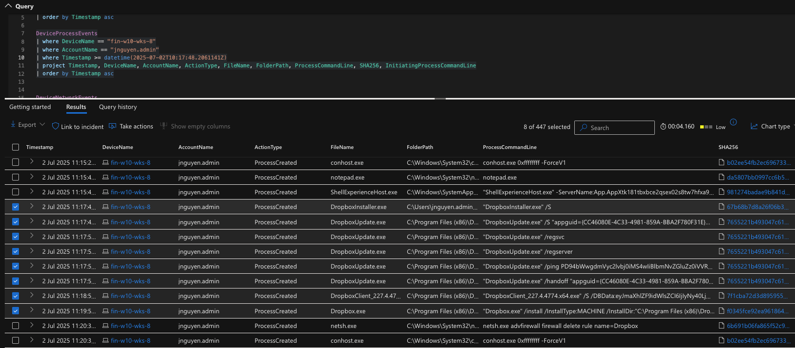
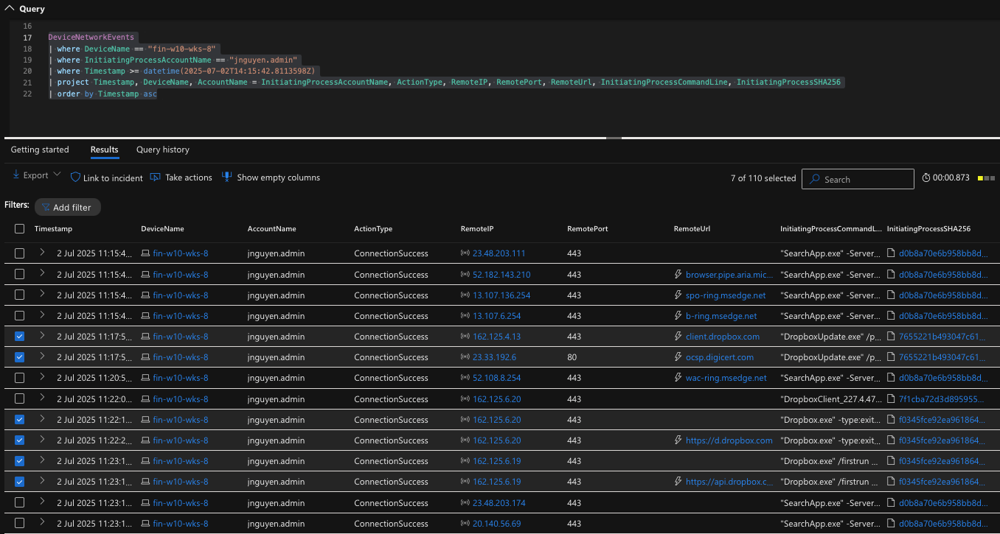
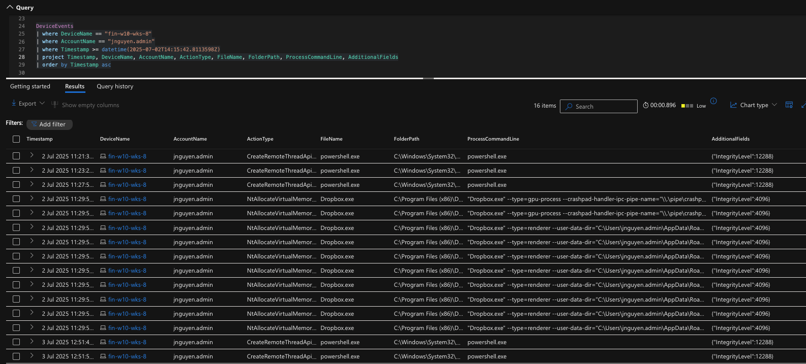
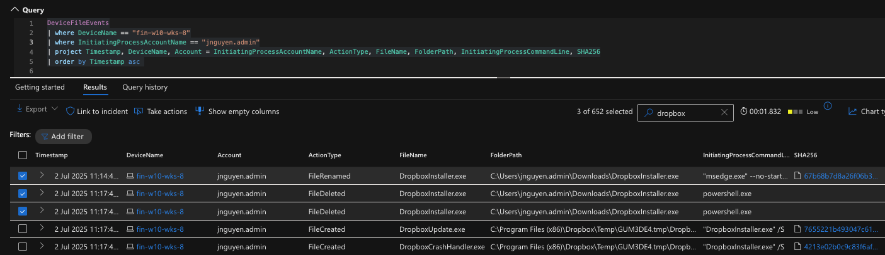
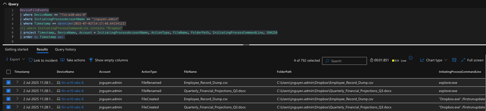
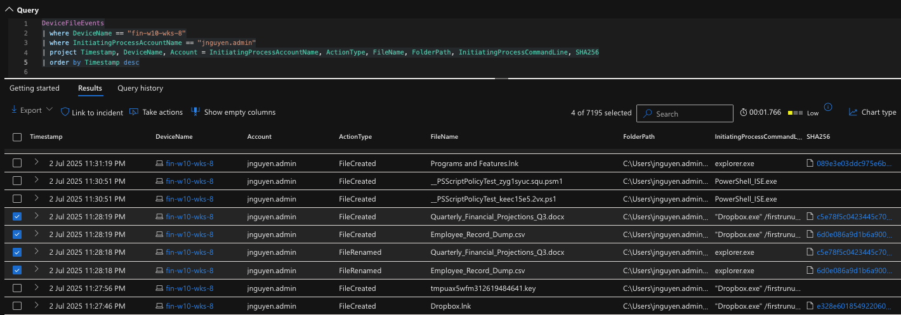
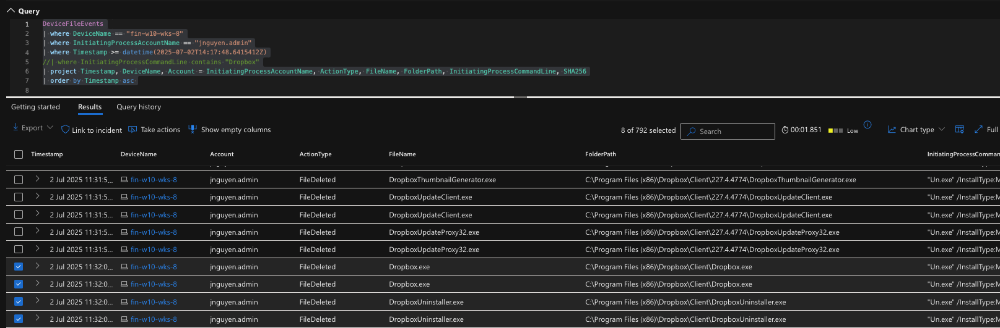
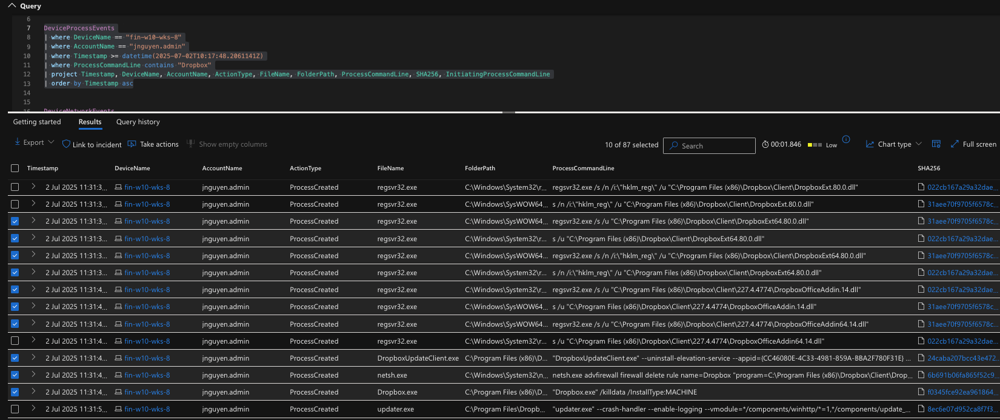

# Threat Hunt Report: Dropbox Data Exfiltration

## Platforms and Languages Leveraged

* Windows 10 Virtual Machines (Microsoft Azure)
* EDR Platform: Microsoft Defender for Endpoint (MDE)
* Kusto Query Language (KQL)
* Dropbox Desktop Application

---

## Scenario

An employee in the finance department reported witnessing a colleague drag and drop documents into a web-based Dropbox interface. Dropbox is not authorised within the company, and concerns were raised about potential data exfiltration. The incident was escalated to the Security Operations Center (SOC) to investigate any unauthorized Dropbox usage and whether sensitive files were transferred externally.

[See how I built this hunt: Step-by-step scenario creation for Dropbox Exfiltration](dropbox_exfiltration_scenario_creation.md)

## 🔗 Kill Chain ↔ MITRE ATT&CK Mapping

🧱 **Cyber Kill Chain** → 🎯 **MITRE ATT&CK Techniques**

- **Delivery** → `T1105 – Ingress Tool Transfer`  
  *(Dropbox client downloaded and introduced into the system)*

- **Installation** → `T1059.001 – Command and Scripting Interpreter: PowerShell`  
  *(Dropbox silently installed using `/S` flag or scripting interface)*

- **Command & Control (C2)** → `T1071.001 – Application Layer Protocol: Web Protocols`  
  *(Dropbox syncing via HTTPS connections to api.dropbox.com, client.dropbox.com)*

- **Actions on Objectives** → `T1567.002 – Exfiltration Over Web Services: Dropbox`  
  *(Sensitive files placed into Dropbox folder and transferred externally)*

## Hunt Objective

Investigate whether Dropbox or other unauthorized cloud storage services have been accessed within the corporate network. Determine if any sensitive or confidential data was exfiltrated by the suspected user or others.

Detection of unauthorised Dropbox installation and data exfiltration on Workstation: **`FIN-W10-WKS-8`**

---

### High-Level Dropbox-Related IoC Discovery Plan

* **Check `DeviceFileEvents`**

  * Look for Dropbox installer and file activity in Dropbox folders
  * Identify access to or movement of sensitive files (e.g., `.csv`, `.docx`, `.xlsx`)

* **Check `DeviceProcessEvents`**

  * Detect installation or execution of Dropbox executables
  * Confirm use of silent install flags

* **Check `DeviceNetworkEvents`**

  * Look for outbound HTTPS connections to:

    * `dropbox.com`, `api.dropbox.com`, `client.dropbox.com`
  * Identify upload-like behavior and uninstallation attempts

---

## Steps Taken

### 1. Identifying Dropbox Activity in DeviceFileEvents

I queried the `DeviceFileEvents` table on the workstation `fin-w10-wks-8` under user `jnguyen.admin`. The logs confirmed installation of Dropbox, upload of sensitive files, and later deletion of those files.

**Query used:**

```kusto
DeviceFileEvents
| where DeviceName == "fin-w10-wks-8"
| where InitiatingProcessAccountName == "jnguyen.admin"
| where Timestamp >= datetime(2025-07-02T14:17:48.6415412Z)
| order by Timestamp asc
| project Timestamp, FileName, FolderPath, ActionType, InitiatingProcessCommandLine, SHA256
```



**Key Findings:**

* Dropbox installer downloaded: `DropboxInstaller.exe` at `14:14:42`
* Sensitive files added to `C:\Users\jnguyen.admin\Dropbox\`:

  * `Employee_Record_Dump.csv`
  * `Quarterly_Financial_Projections_Q3.docx`
* Files later deleted from Dropbox directory around `14:32`

[DeviceFileEvents Logs →](logs/dropbox-exfiltration-file-logs.csv)

---

### 2. Confirming Dropbox Installation via DeviceProcessEvents

**Query used:**

```kusto
DeviceProcessEvents
| where DeviceName == "fin-w10-wks-8"
| where AccountName == "jnguyen.admin"
| where Timestamp >= datetime(2025-07-02T10:17:48.2061141Z)
| where ProcessCommandLine contains "Dropbox"
| order by Timestamp asc
| project Timestamp, FileName, FolderPath, ProcessCommandLine, SHA256
```



**Key Findings:**

* Dropbox installed via: `DropboxInstaller.exe /S` (silent install) at `14:17:48`
* `Dropbox.exe` observed running at `14:29`
* Uninstallation process initiated around `14:31`

[DeviceProcessEvents Logs →](logs/dropbox-exfiltration-process-logs.csv)

---

### 3. Verifying Network Communication via DeviceNetworkEvents

**Query used:**

```kusto
DeviceNetworkEvents
| where DeviceName == "fin-w10-wks-8"
| where InitiatingProcessAccountName == "jnguyen.admin"
| where Timestamp >= datetime(2025-07-02T14:15:42.8113598Z)
| order by Timestamp asc
| project Timestamp, RemoteIP, RemoteUrl, InitiatingProcessCommandLine
```



**Key Findings:**

* Outbound HTTPS connections to:

  * `client.dropbox.com` → `162.125.4.13` @ `14:22:19`
  * `api.dropbox.com` → `162.125.6.19` and `162.125.6.20`
* Final connection observed at `14:32:49`, correlating with uninstallation activity

[DeviceNetworkEvents Logs →](logs/dropbox-exfiltration-network-logs.csv)

---

### 4. Verifying Local Application and Folder via DeviceEvents

**Query used:**

```kusto
DeviceEvents
| where DeviceName == "fin-w10-wks-8"
| where AccountName == "jnguyen.admin"
| where Timestamp >= datetime(2025-07-02T14:15:42.8113598Z)
| order by Timestamp asc
```



**Key Findings:**

* Execution of `Dropbox.exe` at `14:29:58`
* Folder activity in `AppData\Roaming\Dropbox`

[DeviceEvents Logs →](logs/dropbox-exfiltration-device-logs.csv)

---

## Chronological Event Timeline

### 1. Dropbox Installer Downloaded

* **Timestamp:** 2025-07-02T14:14:42
* **Event:** `DropboxInstaller.exe` downloaded to `Downloads` folder




### 2. Dropbox Installed (Silently)

* **Timestamp:** 2025-07-02T14:17:48
* **Command:** `DropboxInstaller.exe /S`


### 3. File Upload to Dropbox Folder

* **Timestamp:** 2025-07-02T14:28:18
* **Files:**

  * `Employee_Record_Dump.csv`
  * `Quarterly_Financial_Projections_Q3.docx`





### 4. Dropbox Executable Running

* **Timestamp:** 2025-07-02T14:29:58
* **Process:** `Dropbox.exe`


### 5. Outbound Connection to Dropbox

* **Timestamp:** 2025-07-02T14:22:19
* **Remote:** `client.dropbox.com` (162.125.4.13)

### 6. Files Deleted and Application Uninstalled

* **Timestamps:** \~2025-07-02T14:31–14:32
* **Actions:**

  * Dropbox folder purged
  * Final network event to `dropbox.com` at `14:32:49`






---

## Summary

On July 2, 2025, user `jnguyen.admin` on workstation `fin-w10-wks-8` downloaded and installed Dropbox using a silent install flag. Within minutes, confidential company documents were placed in the Dropbox folder and likely uploaded, as confirmed by network telemetry. Shortly after the transfer, Dropbox was uninstalled and local files were deleted, suggesting potential intentional exfiltration and attempted cover-up.

---

## Response Taken

* ✅ **Device Isolation:** `fin-w10-wks-8` isolated via Microsoft Defender for Endpoint
* ✅ **Notification:** User’s direct manager and HR were informed
* ✅ **Incident Response Triggered:** IR team initiated forensic disk image collection
* ✅ **Remediation:**

  * Company-wide memo on unauthorized cloud storage
  * Dropbox domain blocked at the firewall

---

## Additional Notes

* **Data Gaps:** None observed
* **Post-Incident Audit:** Scheduled
