# 🧾 Malware Analysis Report: PwnCrypt Ransomware Simulation

---

## 📄 1. Executive Summary

**Sample Name:** `pwncrypt.ps1`  
**Type:** Simulated Ransomware (Educational)  
**Execution Date:** 2025-08-04  
**Analyst:** Jason Nguyen  
**Purpose:** This is a controlled simulation of ransomware behavior using the `PwnCrypt.ps1` script created by Josh Madakor. The analysis was conducted in an isolated Windows 10 VM onboarded to Microsoft Defender for Endpoint (MDE). The goal was to understand how ransomware operates and learn how to analyze file, log, and network artifacts.


---
## 📚 2. Table of Contents

1. [📄 Executive Summary](#-1-executive-summary)
2. [📚 Table of Contents](#-2-malware-sample-details)
3. [🧬 Malware Sample Details](#-3-malware-sample-details)
4. [🔍 Static Analysis Summary](#-4-static-analysis-summary)
5. [🚀 Dynamic Analysis Summary](#-5-dynamic-analysis-summary)
6. [📡 MDE-Based Artifact Collection (KQL + Logs)](#-6-mde-based-artifact-collection-kql--logs)
7. [🧠 Indicators of Compromise (IOCs)](#-7-indicators-of-compromise-iocs)
8. [🛡️ Mitigation & Detection Recommendations](#-8-mitigation-&-detection-recommendations)
9. [🧩 MITRE ATT&CK Mapping](#-9-mitre-attck-mapping)
10. [📎 Appendix](#-10-appendix)
11. [🧾 Postmortem](#11-postmortem)

---

## 🧬 3. Malware Sample Details

| Field         | Value                                                                 |
|---------------|-----------------------------------------------------------------------|
| Filename      | `pwncrypt.ps1`                                                        |
| SHA-256       | `739D9923E2DDF467CE9F997C82D36BFB72ACCC90ACC40573EAA5E1ABB2097CD8`    |
| File Path     | `C:\ProgramData\pwncrypt.ps1`                                         |
| File Type     | PowerShell script (`.ps1`)                                            |
| Source        | [GitHub - Josh Madakor Public Repo](https://github.com/joshmadakor1/lognpacific-public/blob/main/cyber-range/entropy-gorilla/pwncrypt.ps1) |
| File Size     | 6.29 KB                                                      |
| First Seen    | 31 July 2025 (VirusTotal)               |

---

## 🔍 4. Static Analysis Summary

- **Hash Check:**
  - SHA256: `739D9923E2DDF467CE9F997C82D36BFB72ACCC90ACC40573EAA5E1ABB2097CD8`
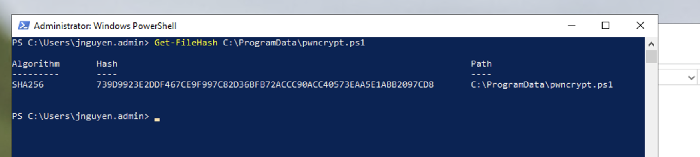

- **Strings:** *(Attempted `strings` extraction, encountered error)*

- **VirusTotal Result:** No detection (0/70), file considered benign.
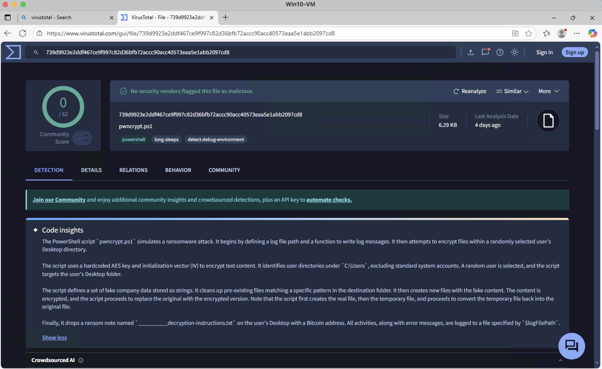
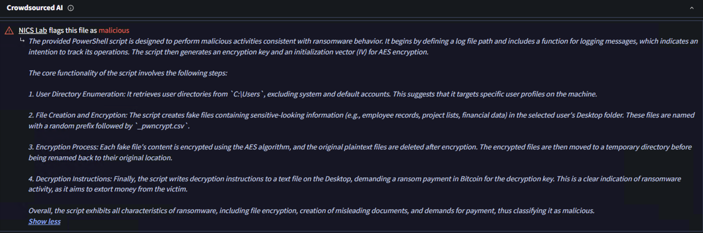
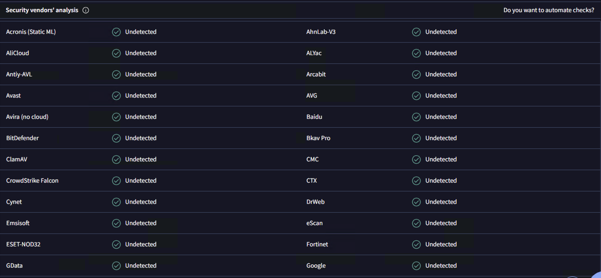

- **PEStudio:**
  - PEStudio ran successfully (screenshots captured).
  - *No anomalies noted due to being a PowerShell script*.
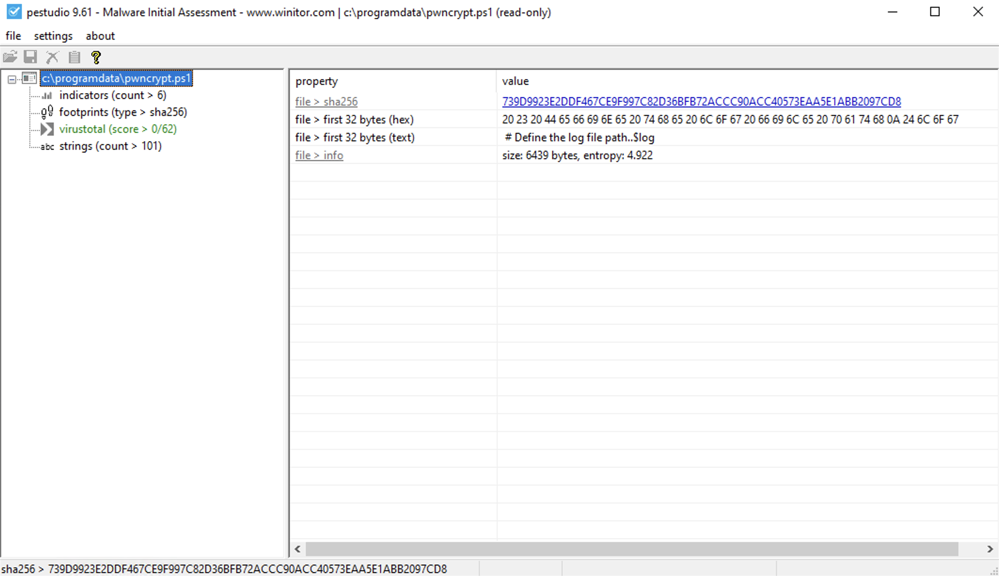
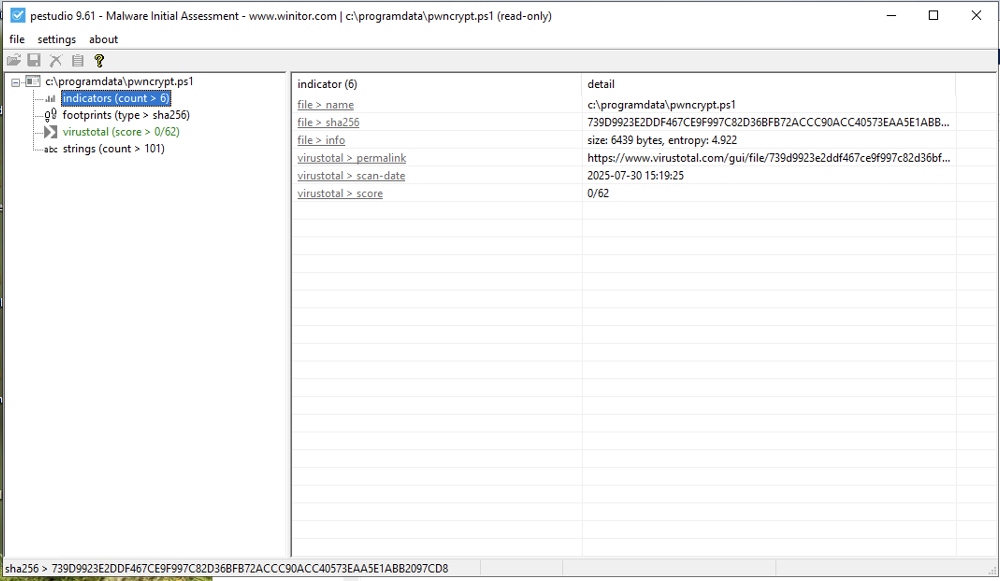
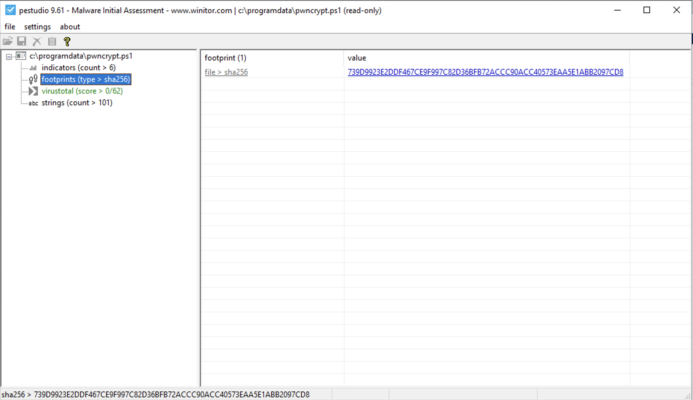
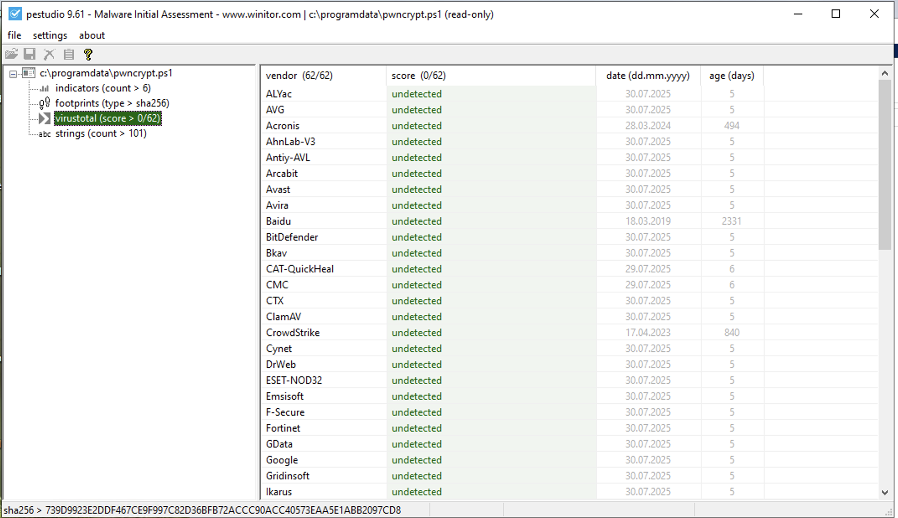
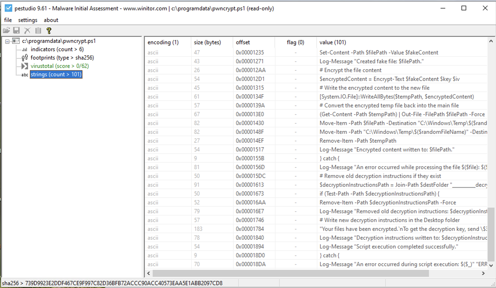

---

## 🚀 5. Dynamic Analysis Summary

### 🖥️ Execution Environment
- **Host:** Windows 10 VM (`j-win10-cve`)
- **Monitoring Tools:** MDE, Event Viewer, PowerShell logs, file system access

### 📂 File System Activity
- Encrypted dummy files detected 
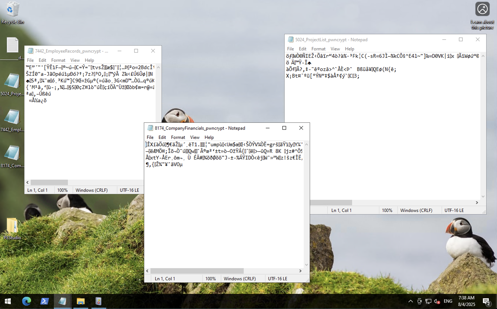

- Ransom note `README.txt` dropped (screenshot taken)
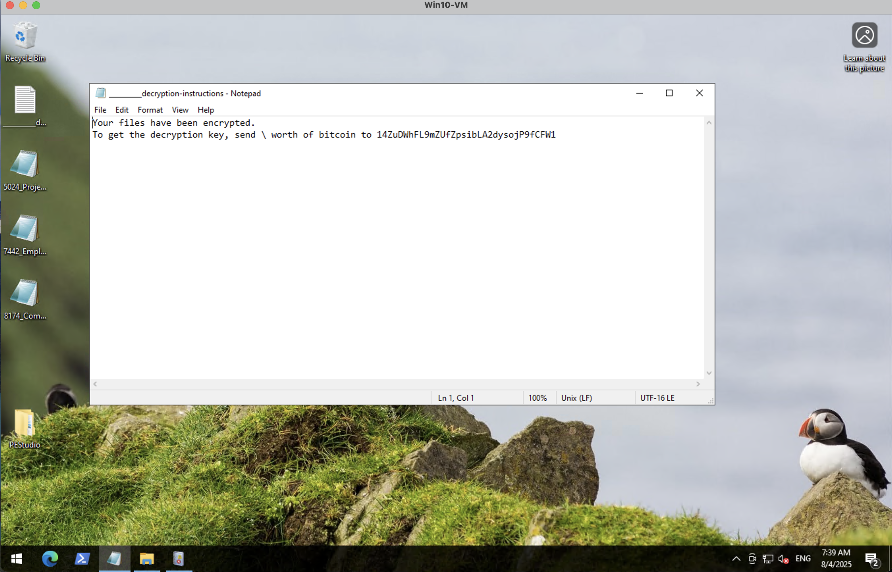

- Script stored at `C:\ProgramData\pwncrypt.ps1` (screenshot taken)
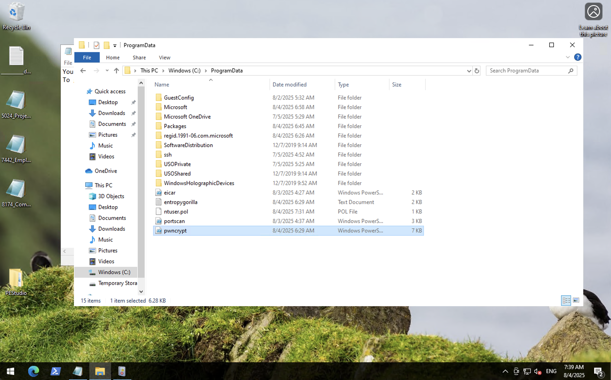
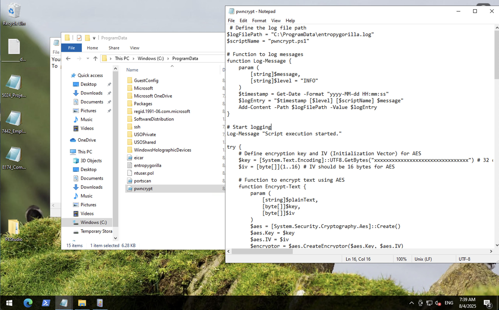

### 🧾 Windows Logs (Event Viewer)
- **Security Logs (4688):**
  - No clear matches outside standard boot processes
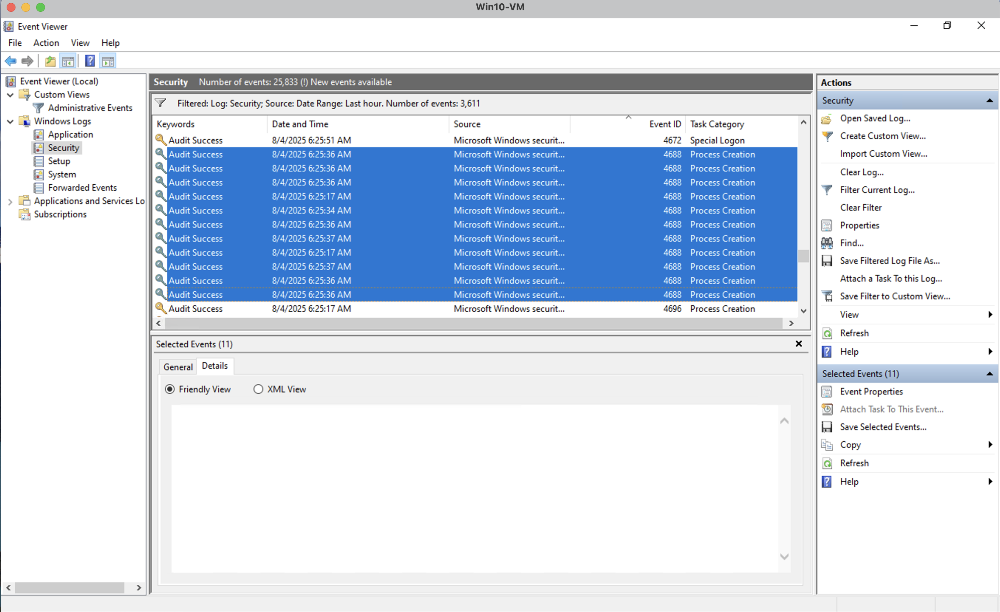

- **PowerShell Operational Logs:**
  - Execution of `pwncrypt.ps1` found at 2025-08-04 06:29:36
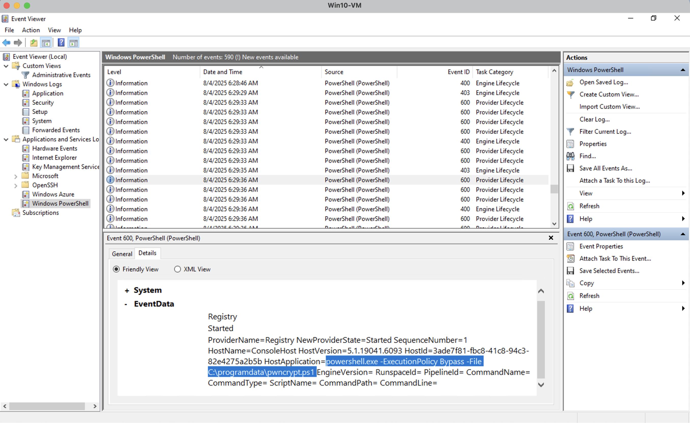

  - 8 total logs captured (screenshots saved)


  - Final event at 2025-08-04 06:29:37
 

- **ScriptBlock Logging:** Not available (PowerShell Operational Logs were disabled)

---

## 📡 6. MDE-Based Artifact Collection (KQL + Logs)

### 🔍 File Events (`DeviceFileEvents`)
```kql
DeviceFileEvents
| where DeviceName == "j-win10-cve"
| where InitiatingProcessAccountName == "jnguyen.admin"
| where Timestamp between (datetime(2025-08-04T06:29:35.8265017Z) .. datetime(2025-08-04T06:29:37.3271798Z))
| project Timestamp, DeviceName, Account = InitiatingProcessAccountName, ActionType, FileName, FolderPath, InitiatingProcessCommandLine, SHA256
| order by Timestamp asc
````

* **Status:** Query executed, logs exported, and screenshot captured.
* [See DeviceFileEvents CSV here](logs/devicefileevents.csv)

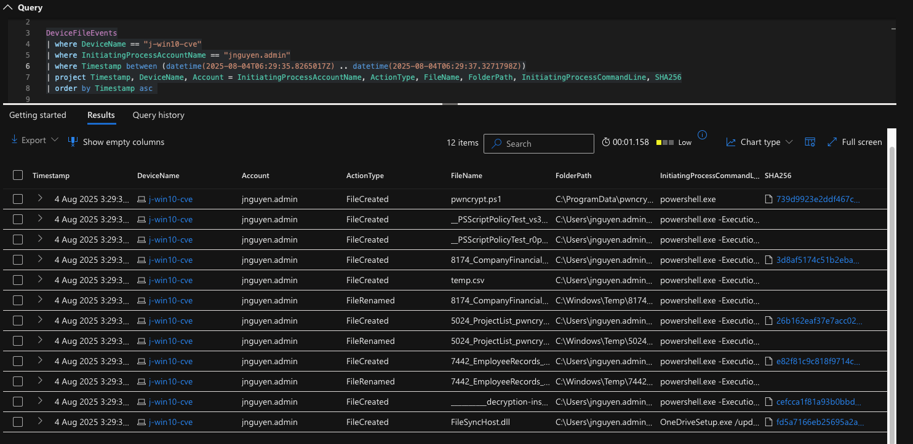

### ⚙️ Process Events (`DeviceProcessEvents`)

```kql
DeviceProcessEvents
| where DeviceName == "j-win10-cve"
| where AccountName == "jnguyen.admin"
| where Timestamp between (datetime(2025-08-04T06:29:35.8265017Z) .. datetime(2025-08-04T06:29:37.3271798Z))
| project Timestamp, DeviceName, AccountName, ActionType, FileName, FolderPath, ProcessCommandLine, SHA256, InitiatingProcessCommandLine
| order by Timestamp asc
```

* **Status:** Logs and screenshots captured, CSV export completed.
* [See DeviceProcessEvents CSV here](logs/deviceprocessevents.csv)

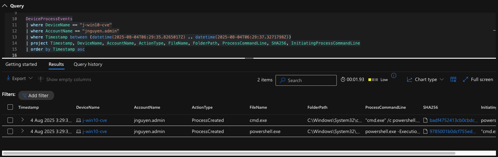


### 🌐 Network Events (`DeviceNetworkEvents`)

```kql
DeviceNetworkEvents
| where DeviceName == "j-win10-cve"
| where InitiatingProcessAccountName == "jnguyen.admin"
| where RemoteIP == "185.199.111.133"
| project Timestamp, DeviceName, AccountName = InitiatingProcessAccountName, ActionType, RemoteIP, RemotePort, RemoteUrl, InitiatingProcessCommandLine, InitiatingProcessSHA256
| order by Timestamp asc
```

* **Status:** Logs and screenshots captured for suspicious outbound IP connection.
* [See DeviceNetworkEvents CSV here](logs/devicenetworkevents.csv)

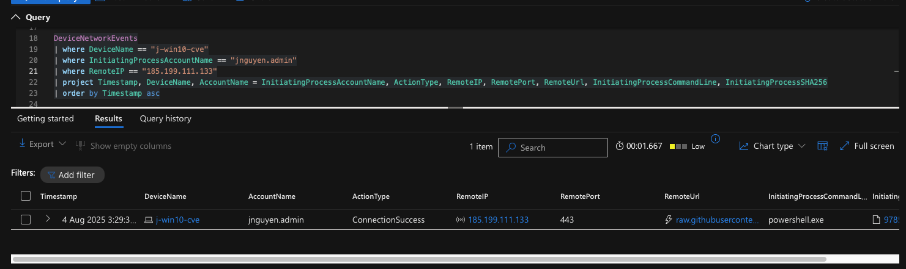

---

## 🧠 7. Indicators of Compromise (IOCs)

### 🔗 Hashes

| Type    | Value                                                              |
| ------- | ------------------------------------------------------------------ |
| SHA-256 | `739D9923E2DDF467CE9F997C82D36BFB72ACCC90ACC40573EAA5E1ABB2097CD8` |

### 🗂 File Artifacts

* `C:\ProgramData\pwncrypt.ps1`
* `C:\Users\jnguyen.admin\Desktop\__________decryption-instructions` *(ransom note)*

### 🌐 Network IOCs

| Type | Value             |
| ---- | ----------------- |
| IP   | `185.199.111.133` |

---

## 🛡️ 8. Mitigation & Detection Recommendations

* Block outbound access to `185.199.111.133` in firewall/DNS
* Review PowerShell execution policies and logging settings
* Enable ScriptBlock logging for deeper audit visibility
* Consider adding SHA256 to EDR or AV blocklists
* Restore any modified or encrypted files from backup

---

## 🧩 9. MITRE ATT\&CK Mapping

| Technique | Description                        | ID               |
| --------- | ---------------------------------- | ---------------- |
| T1059.001 | PowerShell execution               | Execution        |
| T1047     | Windows Management Instrumentation | Execution        |
| T1027     | Obfuscated Files or Information    | Defense Evasion  |

---

## 📎 10. Appendix

* 📸 Screenshots of PEStudio, file artifacts, ransom note
* 📁 Exported logs from MDE
* 🔗 VirusTotal link: [VT scan](https://www.virustotal.com/gui/file/739D9923E2DDF467CE9F997C82D36BFB72ACCC90ACC40573EAA5E1ABB2097CD8)
* 📝 Event Viewer screenshots
* *(Add any external references or tools used)*

---

## 11. Postmortem
* Didn't complete a section on reverse engineering or manual code analysis

*End of Report*


