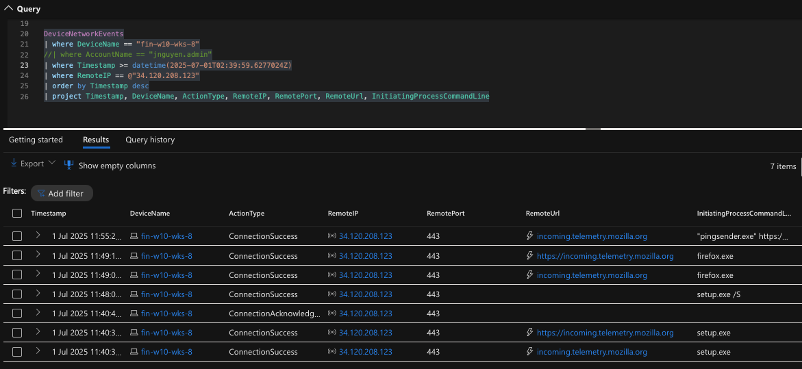

# Threat Hunt Report: Unauthorized Firefox Installation and Extension Usage

## Platforms and Languages Leveraged

* Windows 10 Virtual Machines (Microsoft Azure)
* EDR Platform: Microsoft Defender for Endpoint
* Kusto Query Language (KQL)
* Mozilla Firefox
* Free Download Manager (FDM)

---

## Scenario

Following a management directive triggered by cybersecurity alerts about increasing malware delivery through fake browser updates and malicious Firefox extensions, the cybersecurity team was tasked with identifying any unauthorized Firefox browser installations or browser extension activity across the organization's endpoints.

### High-Level Firefox-Related IoC Discovery Plan

* **Check `DeviceFileEvents`** for Firefox (`firefox.exe`) and FDM-related file activity
* **Check `DeviceProcessEvents`** for silent installation patterns and browser launches
* **Check `DeviceNetworkEvents`** for outbound connections to Mozilla, FDM, and extension sites

---

## Steps Taken

### 1. Identifying Firefox Installer and Activity in DeviceFileEvents

I queried the `DeviceFileEvents` table for file activity related to Firefox and FDM on workstation `fin-w10-wks-8`, under user `jnguyen.admin`. This revealed silent installs via PowerShell and subsequent deletion of the installers.

**Query used:**

```kusto
DeviceFileEvents
| where DeviceName == "fin-w10-wks-8"
| where InitiatingProcessAccountName == "jnguyen.admin"
| where Timestamp >= ago(1d)
| order by Timestamp desc
| project Timestamp, FileName, FolderPath, ActionType, InitiatingProcessCommandLine, SHA256
```


**Key Findings:**

* Detected: `Firefox Setup 140.0.2.exe`
* Detected: `fdm_x64_setup.exe` (Free Download Manager)
* Both files executed silently and deleted post-installation
* Created file: `uBlock0@raymondhill.net.xpi` (UBlock Origin extension)

---

### 2. Detecting Silent Installation via DeviceProcessEvents

**Query used:**

```kusto
DeviceProcessEvents
| where DeviceName == "fin-w10-wks-8"
| where AccountName == "jnguyen.admin"
| where Timestamp >= datetime(2025-07-01T02:39:59.6277024Z)
| order by Timestamp desc
| project Timestamp, FileName, FolderPath, ProcessCommandLine, SHA256
```


**Key Findings:**

* Firefox installed with command: `cmd.exe /c "Firefox Setup 140.0.2.exe /S"`
* FDM installed with command: `fdm_x64_setup.exe /S`

---

### 3. Verifying Network Communication via DeviceNetworkEvents

**Query used:**

```kusto
DeviceNetworkEvents
| where DeviceName == "fin-w10-wks-8"
| where Timestamp >= datetime(2025-07-01T02:39:59.6277024Z)
| order by Timestamp desc
| project Timestamp, RemoteIP, RemoteUrl, InitiatingProcessCommandLine
```


**Key Findings:**

* Connected to: `34.120.208.123` (Mozilla Telemetry)
* Connected to: `74.117.181.203` (freedownloadmanager.org)
* Connected to: `172.66.44.77` and `185.199.111.153` (UBlock Origin)

---

## Chronological Event Timeline

### 1. Firefox Installer Execution

* **Timestamp:** 2025-07-01T02:40:17Z
* **Event:** Detected execution of Firefox Setup with silent install flag
* **Command:** `cmd.exe /c "Firefox Setup 140.0.2.exe /S"`


### 2. Firefox Telemetry Connection

* **Timestamp:** 2025-07-01T02:40:39Z
* **Event:** Connection to Mozilla telemetry: `34.120.208.123`



### 3. UBlock Origin Installation Activity

* **Timestamp:** 2025-07-01T02:50:28Z
* **Event:** File `uBlock0@raymondhill.net.xpi` created
* **Follow-up Connections:**

  * `172.66.44.77` (pages.dev)
  * `185.199.111.153` (github.io)


### 4. Free Download Manager Activity

* **Timestamp:** 2025-07-01T02:50:59Z
* **Event:** `fdm_x64_setup.exe` created and executed silently
* **Connection:** `74.117.181.203`
* **Deletion of Installer:** 2025-07-01T02:55:37Z


---

## Summary

On July 1, 2025, user `jnguyen.admin` on workstation `fin-w10-wks-8` downloaded and silently installed **Firefox**. Shortly after, browser activity was confirmed via telemetry and connections to **UBlock Origin** extension domains. A `.xpi` file associated with UBlock Origin was also created.

The user then downloaded and silently installed **Free Download Manager**, and deleted both installer files post-installation, suggesting a potential attempt to hide the activity.

---

## Response Taken

* **Device Isolation:** `fin-w10-wks-8` was isolated via Microsoft Defender for Endpoint
* **Notification:** User's direct manager was informed
* **Remediation:**

  * Firefox, UBlock Origin, and Free Download Manager were removed
  * IT reissued policies prohibiting unauthorized software

---

## Additional Notes

* **MITRE ATT\&CK Mapping:** Pending
* **Data Gaps:** None noted
* **KQL Query Logs:** Available upon request
* **Screenshot Evidence:** Collected locally for internal review
