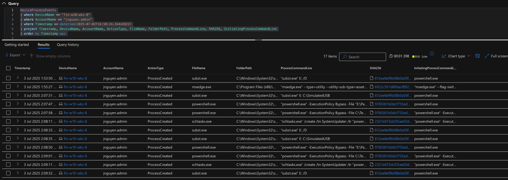
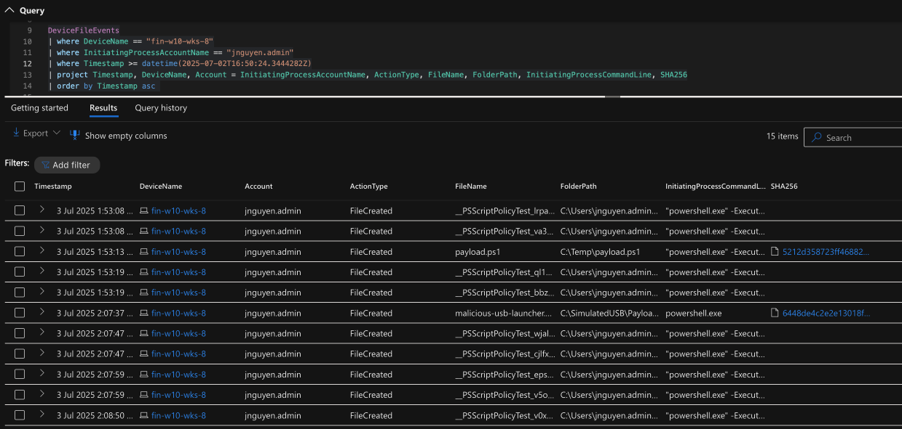
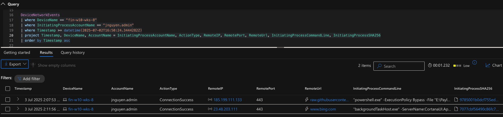

# Threat Hunt Report: USB Malware Execution via PowerShell

## Platforms and Languages Leveraged

- Windows 10 Virtual Machine (Microsoft Azure)
- EDR Platform: Microsoft Defender for Endpoint (MDE)
- Kusto Query Language (KQL)
- PowerShell

---

## Scenario

A junior employee found a USB drive outside the office and inserted it into their workstation later that day. Upon connection, a command window briefly appeared before vanishing. Concerned, the employee reported the behavior to the helpdesk, which escalated the matter to the cybersecurity team. The device was promptly disconnected from the network for investigation. The SOC team launched a hunt to determine whether malicious code was executed, whether persistence mechanisms were established, and if any lateral movement or network communication occurred.

---

## 🔗 Kill Chain ↔ MITRE ATT&CK Mapping

🧱 **Cyber Kill Chain** → 🎯 **MITRE ATT&CK Techniques**

- **Delivery** → `T1200 – Hardware Additions`  
  *(Malicious USB physically introduced into the environment)*

- **Execution** → `T1059.001 – Command and Scripting Interpreter: PowerShell`  
  *(PowerShell script launched from USB device)*

- **Persistence** → `T1053.005 – Scheduled Task/Job: Scheduled Task`  
  *(schtasks used to persist malicious script execution)*

- **Command & Control (C2)** → `T1071.001 – Application Layer Protocol: Web Protocols`  
  *(Outbound HTTPS to raw.githubusercontent.com)*

---

## Hunt Objective

Investigate whether a USB device introduced into **`FIN-W10-WKS-8`** executed malicious code, particularly via PowerShell. Assess if persistence mechanisms or C2 activity occurred and if any lateral movement was initiated.

---

## High-Level USB Malware IoC Discovery Plan

### ✅ Check `DeviceProcessEvents`

- Detect USB-launched executables (e.g., `malicious-usb-launcher.ps1`)
- Flag PowerShell execution with `-ExecutionPolicy Bypass` and suspicious flags
- Identify use of `schtasks.exe`, scripting interpreters, or unusual subprocesses

### ✅ Check `DeviceFileEvents`

- Identify creation of suspicious script files (e.g., `.ps1`, `.bat`) from USB paths (`E:\`, `\\?\Volume`)
- Flag double extension files (e.g., `invoice.pdf.exe`)
- Detect files dropped in `C:\Temp\`, `%AppData%`, or startup folders

### ✅ Check `DeviceNetworkEvents`

- Look for outbound connections by PowerShell
- Investigate traffic to rare IPs or domains (e.g., `raw.githubusercontent.com`)

### ✅ Check `DeviceEvents` and `DevicePlugAndPlayEvents`

- Identify when and what USB devices were connected
- Correlate with execution timestamps

### ✅ Check for Lateral Movement / Persistence

- Search for `schtasks`, `reg.exe`, or RDP activity
- Look for unauthorized accounts, registry changes, or suspicious logons

---

## Steps Taken

### 1. Investigating Process Execution via `DeviceProcessEvents`

Filtered logs for account `jnguyen.admin` around the time the USB was inserted:

```kql
DeviceProcessEvents
| where DeviceName == "fin-w10-wks-8"
| where AccountName == "jnguyen.admin"
| where Timestamp >= datetime(2025-07-02T16:50:24.3444282Z)
| order by Timestamp asc
````

**Key Findings:**

| Timestamp           | Command Executed                                                                                                                     |
| ------------------- | ------------------------------------------------------------------------------------------------------------------------------------ |
| 2025-07-02 16:52:52 | `subst.exe E: C:\SimulatedUSB`                                                                                                       |
| 2025-07-02 16:53:07 | `powershell.exe -ExecutionPolicy Bypass -File "E:\Payload\malicious-usb-launcher.ps1"`                                               |
| 2025-07-02 16:53:18 | `powershell.exe -ExecutionPolicy Bypass -File C:\Temp\payload.ps1`                                                                   |
| 2025-07-02 16:53:30 | `schtasks.exe /create /tn SystemUpdater /tr "powershell.exe -ExecutionPolicy Bypass -File C:\Temp\payload.ps1" /sc minute /mo 30 /f` |

🔁 **Same activity repeated twice more**:

* 17:07:31 to 17:08:33
* 17:08:35 to 17:09:32

📎 [DeviceProcessEvents Logs →](logs/usb-malware-exe-deviceprocessevents.csv)



---

### 2. File Activity Analysis via `DeviceFileEvents`

```kql
DeviceFileEvents
| where DeviceName == "fin-w10-wks-8"
| where InitiatingProcessAccountName == "jnguyen.admin"
| where Timestamp >= datetime(2025-07-02T16:50:24.3444282Z)
| order by Timestamp asc
```

**Key Findings:**

* `Payload.ps1` created in `C:\Temp\` → 2025-07-02 16:53:13
* `malicious-usb-launcher.ps1` created from USB path → 2025-07-02 17:07:37

📎 [DeviceFileEvents Logs →](logs/usb-malware-exe-devicefileevents.csv)



---

### 3. Network Activity via `DeviceNetworkEvents`

```kql
DeviceNetworkEvents
| where DeviceName == "fin-w10-wks-8"
| where InitiatingProcessAccountName == "jnguyen.admin"
| where Timestamp >= datetime(2025-07-02T16:50:24.3444282Z)
```

**Key Findings:**

* **Connection to `raw.githubusercontent.com`**
  → IP: `185.199.111.133`
  → Port: `443`
  → Timestamp: `2025-07-02 17:07:53`

📎 [DeviceNetworkEvents Logs →](logs/usb-malware-exe-devicenetworkevents.csv)



---

### 4. System Events via `DeviceEvents`

```kql
DeviceEvents
| where DeviceName == "fin-w10-wks-8"
| where AccountName == "jnguyen.admin"
| where Timestamp >= datetime(2025-07-02T16:50:24.3444282Z)
```

**Key Findings:**
⚠️ No relevant entries found (DeviceEvents may not log plug-and-play activity unless specifically configured)

---

### 5. Additional Validation Checks

* **DeviceLogonEvents:**
  No unusual logon behavior within ±10 minutes of incident.

* **DeviceRegistryEvents:**
  No registry persistence mechanisms identified.

---

## Chronological Event Timeline

| Time     | Action                                                                |
| -------- | --------------------------------------------------------------------- |
| 16:50    | USB inserted into `FIN-W10-WKS-8`                                     |
| 16:52    | Virtual drive mapped via `subst.exe`                                  |
| 16:53    | Malicious PowerShell script executed from USB                         |
| 16:53    | Scheduled task `SystemUpdater` created to run `payload.ps1` every 30m |
| 17:07–09 | Scripts re-executed (likely testing or redundancy)                    |
| 17:07    | Connection to GitHub’s `raw.githubusercontent.com` domain             |

---

## Summary

A USB device inserted into workstation `FIN-W10-WKS-8` by user `jnguyen.admin` triggered a chain of PowerShell-based actions. A malicious script was launched from the USB, copied to local storage, and scheduled for repeated execution using `schtasks.exe`. The script initiated outbound HTTPS communication with a GitHub IP address, indicating possible download of additional payloads or beaconing. No signs of lateral movement were detected, and the malicious activity appeared isolated to this single endpoint.

---

## Response Taken

* ✅ **Device Isolation:** `FIN-W10-WKS-8` removed from the network
* ✅ **User Interviewed:** Confirmed non-malicious intent (plugged in unknown USB)
* ✅ **Scheduled Task Removed:** `SystemUpdater` task deleted
* ✅ **Malware Artifacts Removed:** `payload.ps1`, `malicious-usb-launcher.ps1` purged
* ✅ **IOCs Blocked:** GitHub IP/domain temporarily blocked for analysis

---

## Additional Notes

* **Lessons Learned:** Reinforce USB security policies and launch security awareness refresher
* **Data Gaps:** None identified
* **Forensic Imaging:** Scheduled for deeper file analysis
  
---

## 📘 Postmortem

You can read the full project retrospective, including what worked, what didn’t, and what I plan to improve in the future here:  
🔗 [Read the full postmortem →](project-postmortem.md)


